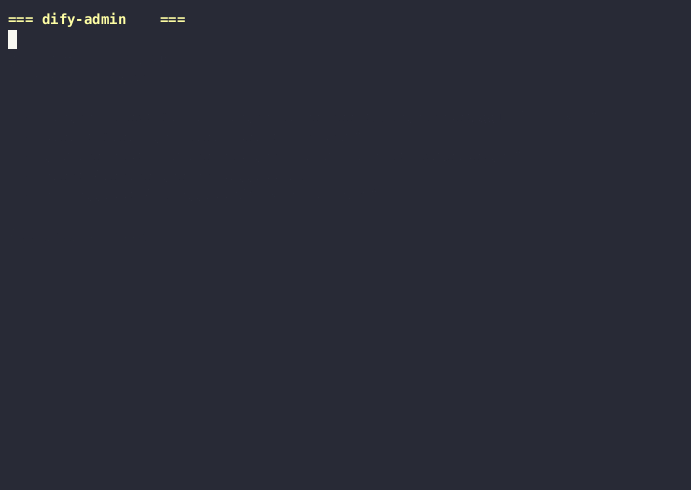
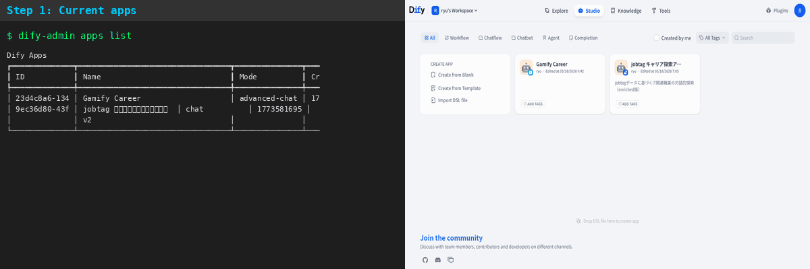

# DifyOps

> Product: **DifyOps** / GitHub repo: `difyops` / CLI & Python package: `dify-admin`

DifyOps は、Dify を GUI ではなく、**CLI・Python・生成AI（MCP）** から管理するための運用基盤です。

Claude Code や Cursor から自然言語で Dify のアプリ・ナレッジベース・設定変更を操作でき、`plan/apply` による desired state 管理、設定差分、スナップショット、監査ログにより、Dify 運用に **再現性・安全性・説明可能性** を持ち込めます。

> **セルフホスト版 Dify v1.13+ 専用**です。クラウド版 Dify（cloud.dify.ai）には対応していません。



### CLI + Web UI 連動


## なぜ必要か

Dify の運用は、作る段階よりも運用段階で手間が増えます。

- GUI でしか触れない操作が多い
- 同じ設定変更を複数アプリに反映しにくい
- dev / prod の差分比較がしづらい
- ナレッジベースの同期が手作業になりやすい
- 変更履歴やロールバックが弱い
- AI 開発フローに Dify 運用を組み込みづらい

**DifyOps** は、この **運用の摩擦を減らす** ためのツールです。

## できること

- **AI から Dify を自然言語で操作**（MCP サーバー 38 ツール）
- **CLI 38 コマンド** でアプリ作成 / 複製 / 差分確認 / 設定変更
- **ナレッジベースの同期と更新**（checksum 検知、chunking 設定）
- **YAML で desired state** を定義して `plan` / `apply`
- **変更履歴の監査**、スナップショット、復元
- **Config Patching** — `model.name=gpt-4o` のように dot-notation で設定変更
- **環境差分比較** — dev と prod のアプリ・KB を比較

## こんな人向け

- Dify をセルフホストで運用している
- GUI の手作業を減らしたい
- Dify 環境を再現可能にしたい
- 生成 AI から Dify の運用を自動化したい
- dev / prod の差分や設定変更を管理したい

## 要件

- Python 3.10+
- [Dify](https://github.com/langgenius/dify) セルフホスト版（v1.13+）

## インストール

```bash
# GitHub からインストール
pip install git+https://github.com/CaCC-Lab/difyops.git

# MCP サーバーも使う場合
pip install "dify-admin[mcp] @ git+https://github.com/CaCC-Lab/difyops.git"

# ローカル開発の場合
git clone https://github.com/CaCC-Lab/difyops.git
cd difyops
pip install -e ".[dev,mcp]"
```

## MCP サーバー（AI 連携）

Claude Code や Cursor から Dify を自然言語で管理できます。

### セットアップ

`.mcp.json`:

```json
{
  "mcpServers": {
    "difyops": {
      "command": "uv",
      "args": ["run", "--directory", "/path/to/difyops", "--extra", "mcp", "dify-admin", "mcp", "serve"],
      "env": {
        "DIFY_URL": "http://localhost:5001",
        "DIFY_EMAIL": "admin@example.com",
        "DIFY_PASSWORD": "password"
      }
    }
  }
}
```

`.env` ファイルに認証情報を書けば `.mcp.json` から除外できます:

```bash
# .env
DIFY_URL=http://localhost:5001
DIFY_EMAIL=admin@example.com
DIFY_PASSWORD=password
```

### 使用例（AI に話しかけるだけ）

```
「アプリ一覧を見せて」
「FAQ Bot の設定を確認して」
「temperature を 0.7 にして」
「このアプリをコピーして」
「devとprodの違いを見せて」
「さっき何を変更した？」
```

### 安全設計

状態変更を伴う MCP ツールには、docstring に `DESTRUCTIVE:` マーカーを付けています。このマーカーにより、MCP クライアントや AI アシスタント側で**実行前確認フローを実装しやすく**しています。

また、`explain` ツールを使うことで、各操作の目的・リスク・取り消し方法を事前確認できます。

> **Important:** MCP 側の確認強制は、最終的には MCP クライアント / AI アシスタントの実装に依存します。サーバー側で一律にブロックする仕組みではありません。

**read-only モード:** `DIFY_ADMIN_MODE=readonly` を設定すると、Dify リモートへの状態変更を伴う DESTRUCTIVE ツールがサーバー側でブロックされます。ローカルへのスナップショット保存（`apps_snapshot`）は read-only モードでも実行可能です。

CLI 側では、より明示的な安全柵を提供しています:
- `--dry-run` — 実行前プレビュー
- `--yes` — 確認スキップ
- `confirm_destructive` — 対話確認

### 38 MCP ツール

| カテゴリ | ツール |
|---------|--------|
| アプリ情報 | `apps_list`, `apps_get`, `apps_search`, `apps_config_get`, `apps_config_get_key`, `apps_export`, `apps_templates` |
| アプリ操作 | `apps_create`, `apps_delete`, `apps_rename`, `apps_clone`, `apps_scaffold`, `apps_import`, `apps_config_set`, `apps_config_patch` |
| アプリ差分 | `apps_diff`, `dsl_diff` |
| スナップショット | `apps_snapshot`, `apps_snapshots`, `apps_restore` |
| KB 情報 | `kb_list`, `kb_docs_list`, `kb_docs_status`, `kb_sync_dry_run` |
| KB 操作 | `kb_create`, `kb_upload`, `kb_docs_delete`, `kb_docs_reindex`, `kb_clear`, `kb_sync` |
| 状態管理 | `state_plan`, `state_apply` |
| 環境 | `env_diff`, `status`, `doctor` |
| 運用 | `audit_list`, `explain`, `list_operations` |

## CLI クイックスタート

現在の CLI コマンド名は `dify-admin` です。

```bash
# 環境変数を設定（毎回 --email/--password を省略可能）
export DIFY_EMAIL=admin@example.com
export DIFY_PASSWORD=password

# 接続チェック
dify-admin doctor

# アプリ一覧
dify-admin apps list

# 名前でアプリ取得
dify-admin apps get --name "FAQ Bot"

# 設定をピンポイント変更
dify-admin apps config patch --name "FAQ Bot" \
  --set model.completion_params.temperature=0.7

# アプリをコピー
dify-admin apps clone --name "FAQ Bot" --clone-name "FAQ Bot v2"

# 2つのアプリを比較
dify-admin apps diff <app_id_1> <app_id_2>

# テンプレートからアプリ作成
dify-admin apps scaffold chat-rag --name "RAG Bot"

# スナップショット取得 → 復元
dify-admin apps snapshot --name "FAQ Bot"
dify-admin apps restore <app_id> <snapshot_id> --yes
```

### ナレッジベース管理

```bash
# ドキュメント一覧
dify-admin kb docs list --name "社内マニュアル"

# ファイルアップロード（chunking 設定付き）
dify-admin kb upload --name "社内マニュアル" ./docs/ \
  --pattern "*.md" --chunk-size 500 --chunk-overlap 50

# 同期（checksum で変更なしスキップ）
dify-admin kb sync --name "社内マニュアル" ./docs/ \
  --recursive --checksum --dry-run

# 同期実行
dify-admin kb sync --name "社内マニュアル" ./docs/ \
  --recursive --checksum --delete-missing --yes
```

### Desired State（Terraform-lite）

`plan` は**差分を確認するためのプレビュー**（read-only）です。`apply` は**実際に変更を適用する操作**（DESTRUCTIVE）です。

```yaml
# state.yml
apps:
  - name: "FAQ Bot"
    mode: chat
    description: "Customer FAQ"
  - name: "Analyzer"
    mode: advanced-chat

knowledge_bases:
  - name: "Company Docs"
    description: "Internal documentation"
```

```bash
dify-admin plan state.yml              # 差分プレビュー
dify-admin apply state.yml --yes       # 適用
dify-admin apply state.yml --delete-missing --yes  # 未定義を削除
```

### 環境差分比較

```bash
dify-admin env-diff \
  --source-url http://dev:5001 \
  --target-url http://prod:5001
```

### JSON 出力

```bash
dify-admin --json apps list | jq '.[].name'
dify-admin --json apps get --name "FAQ Bot" | jq '.model_config.model'
```

## Agent-Friendly CLI

DifyOps CLI は **エージェント（Claude / Cursor 等）からの利用**を想定し、README と各コマンドの `--help` で同じ前提を説明します（REQ-009）。

- **Structured help**: Usage / Description / Options / Side Effects など、`--help` を機械的にパースしやすい構造にしています。
- **JSON 出力**: `--json` では成功時のデータのみ stdout に出し、エラー時は stderr の JSON と終了コードで判定できます。
- **Idempotency**: 各コマンドの Idempotent ラベル（yes / no / conditional）は `--help` の **Idempotent:** 行と整合させています。
- **stdin**: 対応コマンドでは `--file -` または `-` を指定して標準入力から読み込みます。

### Exit codes

CLI の終了コードは `dify_admin.exceptions` の定義と一致します。

| Code | 意味 |
|------|------|
| 0 | 正常終了 |
| 1 | アプリ/API エラー（`DifyAdminError` 等） |
| 2 | CLI の使い方エラー（`UsageError`） |
| 3 | 接続エラー（`DifyConnectionError`） |
| 4 | タイムアウト（`httpx.TimeoutException`） |

### Idempotency 分類

| 分類 | コマンド例 | リトライ |
|------|-----------|---------|
| **yes** | `apps list`, `apps get`, `kb list`, `status`, `doctor`, `plan` | 安全 |
| **no** | `apps create`, `apps delete`, `kb create`, `kb clear`, `audit clear` | 注意 |
| **conditional** | `apps rename`, `apps config set/patch`, `apps restore`, `apply`, `kb sync` | 状態次第 |

### stdin 対応コマンド

| コマンド | 指定方法 |
|---------|---------|
| `apps import` | `--file -` |
| `apps config set` | `--file -` |
| `plan` | `-`（STATE_FILE 引数） |
| `apply` | `-`（STATE_FILE 引数） |

## Python ライブラリ

現在の Python package 名は `dify_admin` です。

```python
from dify_admin import DifyClient

with DifyClient("http://localhost:5001") as client:
    client.login("admin@example.com", "password")

    # アプリ操作
    apps = client.apps_list(fetch_all=True)
    client.apps_clone("app-id", name="Copy of App")
    client.apps_rename("app-id", "New Name")

    # 設定パッチ
    from dify_admin.patch import apply_patches
    config = client.apps_get_config("app-id")
    apply_patches(config, set_ops=[("model.name", "gpt-4o")])
    client.apps_update_config("app-id", config)

    # KB 同期
    from dify_admin.sync import compute_sync_plan, execute_sync
    from pathlib import Path
    plan = compute_sync_plan(client, "dataset-id", Path("./docs"), checksum=True)
    result = execute_sync(client, "dataset-id", plan)
```

### 例外処理

```python
from dify_admin import DifyClient, DifyNotFoundError

with DifyClient() as client:
    client.login("admin@example.com", "password")
    try:
        app = client.apps_get("non-existent-id")
    except DifyNotFoundError as e:
        print(e)        # "App not found: non-existent-id"
        print(e.hint)   # "Check that the app ID is correct"
        print(e.status_code)  # 404
```

## 制限事項

- **セルフホスト版 Dify 専用**です（cloud.dify.ai には非対応）
- MCP 経由の確認フローは、クライアント実装に依存します
- 認証情報は `DIFY_URL`, `DIFY_EMAIL`, `DIFY_PASSWORD` 環境変数または `.env` で渡します（`.env.example` を参照）
- `advanced-chat` / `workflow` モードのアプリでは `apps_config_get` / `apps_config_set` が使えません（Dify API の制約）
- read-only モードの環境変数名は現在 `DIFY_ADMIN_MODE` です

> **Warning:** `reset-password` コマンドは Docker 経由で PostgreSQL に直接アクセスしてパスワードを更新します。Dify の通常 API 操作ではなく DB 直操作です。セルフホスト環境の管理者向け緊急用途に限定してください。

## 開発

```bash
uv venv --python 3.10 .venv && source .venv/bin/activate
uv pip install -e ".[dev,mcp]"

pytest tests/ -v    # 277 テスト
ruff check dify_admin/
ruff format dify_admin/
```

## 更新履歴

### v0.3.0 (2026-03-27)

- **CLI コマンドメタデータ 38 コマンド化** — `apps restore` をコマンドカタログに追加
- **Agent-Friendly CLI** — 全コマンドに構造化ヘルプ（Examples / Side Effects / Idempotent ラベル）
- **stdin 対応** — `apps import --file -`, `apps config set --file -`, `plan -`, `apply -`
- **Exit Code 体系** — 0（成功）/ 1（アプリエラー）/ 2（usage）/ 3（接続）/ 4（タイムアウト）
- **JSON エラー出力** — `--json` モードでエラー時に stderr へ構造化 JSON を出力
- **コマンドメタデータ JSON** — `dify-admin --json` / `dify-admin apps --json` でメタデータ取得
- **--dry-run 拡充** — `apps config set`, `apps import`, `apps rename`, `kb upload` に追加

### v0.2.0 (2026-03-22)

- **DifyOps ブランド** — Product名を DifyOps に統一
- **MCP サーバー 38 ツール** — read-only モード、DESTRUCTIVE マーカー、監査ログ
- **Dify v1.13+ 対応** — ファイルアップロード 2 ステップ化、新 API エンドポイント対応
- **Config Patching** — `--set key=value` / `--unset key` による dot-notation 設定変更
- **環境差分比較** — `env-diff` コマンドで dev/prod 比較
- **KB 同期** — checksum ベースの差分同期、`--delete-missing` オプション

### v0.1.0 (2026-03-18)

- 初回リリース
- CLI 基本コマンド（apps / kb / audit）
- MCP サーバー基盤
- Python ライブラリ（`DifyClient`）
- plan / apply による desired state 管理

## ライセンス

MIT
